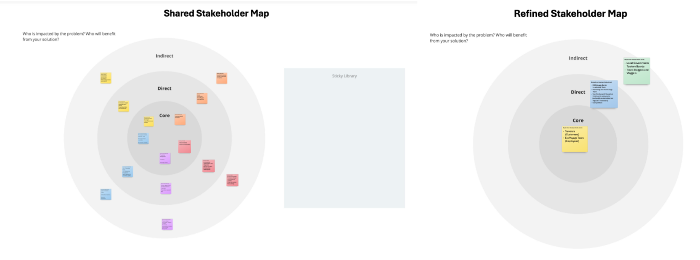
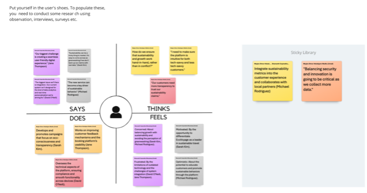
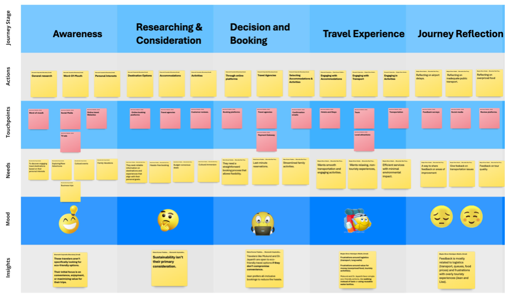
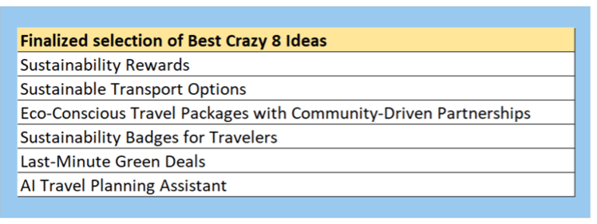
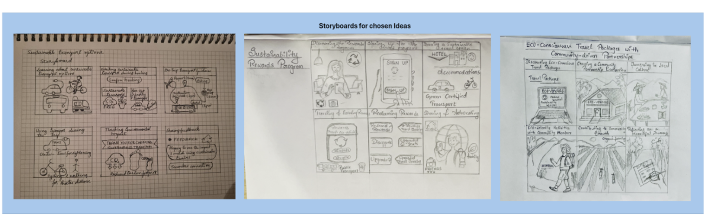
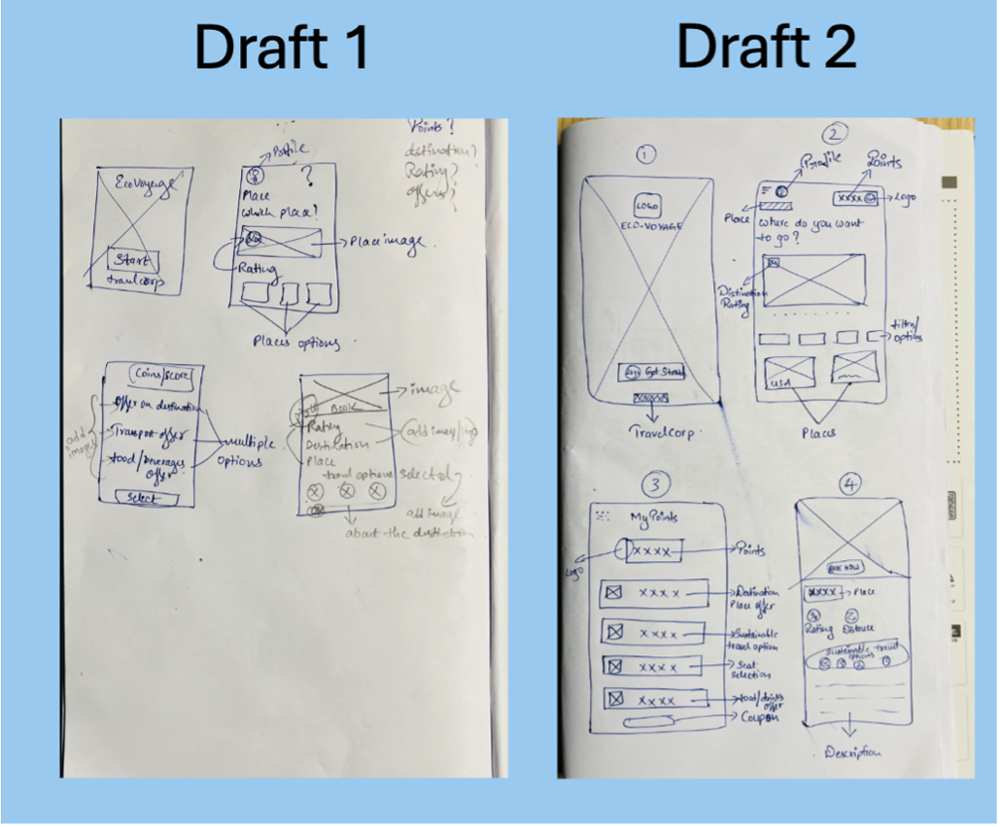
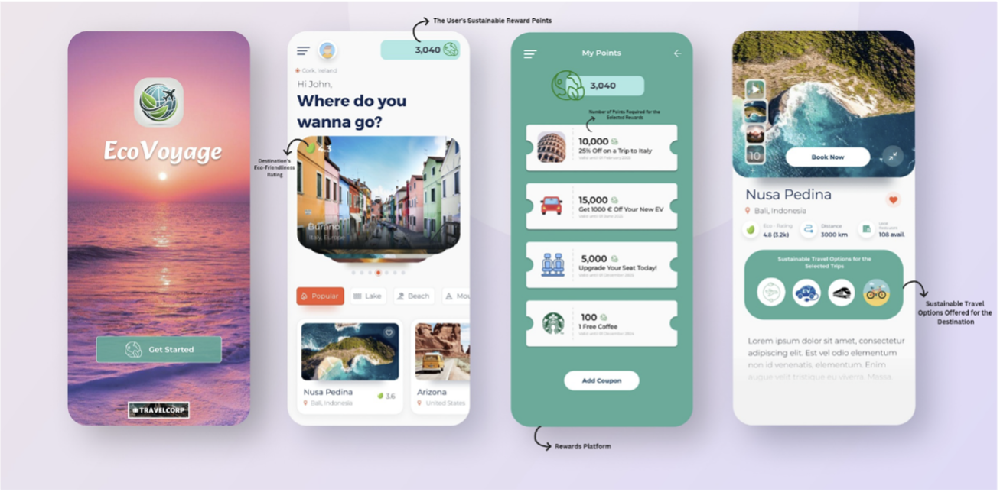
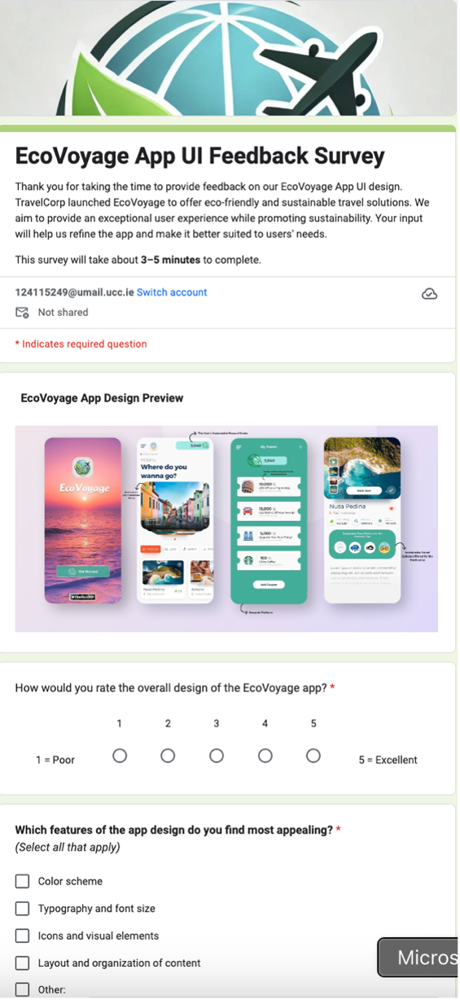

# EcoVoyage: Designing a Sustainable Travel App

A travel app concept taken from research to tested prototype, using the full design
thinking process: empathize, define, ideate, prototype, and test.

## Objective

Design a travel product that helps people plan trips with sustainability in mind,
grounded in what real travellers actually need rather than assumptions.

## The approach

**1. Empathize**: surveys and interviews with travellers, plus stakeholder mapping to
understand who the product serves and who it affects.

**2. Define**: empathy maps and customer journey maps to capture traveller needs,
motivations, and pain points across the full trip lifecycle.

**3. Ideate**: rapid Crazy 8s sketching and team voting to shortlist the strongest
concepts, then storyboarding to think them through as real user experiences.

**4. Prototype**: from hand-drawn wireframes to a polished, interactive Figma design.

**5. Test**: a user feedback survey on the app UI, with findings folded back into the
design.

## The outcome

A tested Figma prototype of a sustainable travel companion, plus validated insights
about how travellers weigh sustainability against cost and convenience when planning
a trip.

## Tools

Figma · Design thinking methods: stakeholder mapping, empathy maps, journey mapping,
Crazy 8s, storyboarding, user testing

## Team

Built during the MSc in Business Analytics at University College Cork by a group of 6 people

*This repository is maintained by Bhoomika Ravi Poojari.*
